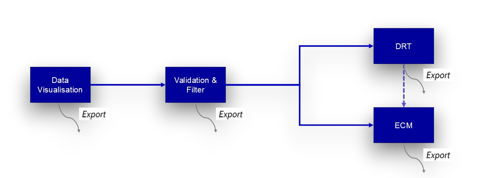

# ZEUS

<p align="center">
  
</p>

ZEUS is a software for batch analysis of Electrochemical Impedance
Spectroscopy (EIS) data. The workflow is modular as shown in the figure below,
with the option to perform manual ECM or a DRT-guided ECM. 
Under the hood, ZEUS utilises [pyimpspec](https://github.com/vyrjana/pyimpspec)'s
Kramers-Kronig/Z-HIT validation, distribution of relaxation times (DRT), and
equivalent circuit model (ECM) fitting functionalities. Each function has been optimised for a
clear step-by-step analysis and balance betweeen speed and accuracy. ZEUS comes with
an interactive graphing tool thanks to PyQtGraph.




## Features

- **Batch loading** of multiple files and sweeps at once.
- **Active data selection** when comparing specific sweep within files that contain multiple
  irrelevant data.
- **Data Visualisation** — interactive and intuitive plotting tool of Nyquist/Bode, residuals and DRT.
- **Validation** — Kramers-Kronig and Z-HIT checks, residual-based outlier
  masking, and iterative point pruning.
- **DRT** — distribution of relaxation times (including Bayesian/credible
  intervals) with semi-automatic peak extraction.
- **ECM** — equivalent circuit fitting with an interactive circuit diagram
  editor, seeded from DRT peaks or built manually via a circuit description
  code (CDC).
- **Sessions** — save the loaded sweeps, validation/DRT/ECM results, and
  filter state to a single file, and reopen it later.

## Supported input files

- BioLogic `.mpt` exports, including Modulo Bat (multi-sweep) files and standard PEIS/GEIS.
- Generic `.txt` / `.csv` exports, with a semi-automatic column-mapping.

## Installation

### Windows installer 

Download the latest `ZEUS-<version>-setup.exe` from Releases/Tags. 
This installs a standalone build that does not require Python or coding.

### Running from source

Requires Python 3.12+.

```bash
# clone the repo
git clone https://github.com/aizadzmz/ZEUS.git

# install dependencies (using uv, or substitute pip/venv as preferred)
cd ZEUS
uv sync

# launch the app via terminal
uv run python -m gui.app
```

## User guide

### Import/Load Data

1. 1)	Upon launch, ZEUS will land on the **Data Visualisation** step.
2. Load data:

   **(a)** Click **Clear All and Add Files…** or **Add Files…** and pick one or more `.mpt`,
   `.txt`, or `.csv` files.
   - For a generic `.txt`/`.csv` file, a popup
     dialog will ask you to confirm which column is frequency, `Z'`,
     `Z''`, etc.
   - `.mpt` files containing multiple PEIS/GEIS sweeps (e.g. Modulo Bat
     sequences) are parsed automatically.

   **(b)** To continue a previous analysis, use **File → Open session…**
   and pick a previously saved `.eisz` session file. This restores the
   loaded sweeps along with any validation/DRT/ECM results and filter
   state already computed.
3. Use the **Active Dataset** list on the bottom right section to select which spectra to work on.
4. Adjust marker shape, marker size and line width if needed in the **Plot Options**.

### Validation

1. Move to the **Validation** step by clicking on it in the progress bar.
2. Removing inductive tail is recommended as ZEUS works best on non-inductive processeses.
3. Choose between **Kramers-Kronig** or **Z-HIT** to see how consistent
   each spectrum is with a linear, causal, stable system.
4. Define residual as *ΔZ/|Z|* or *ΔZ'/Z'*.
5. Choose from either **Basic** or **Advanced** threshold mode:

   **(a) Basic**: One hard limit. Any point above this limit will be removed.

   **(b) Advanced**: One hard limit and one soft limit. Similarly, any point above the hard limit will be removed.
   On top of that, the *worst* point between the soft and hard limit will be discarded. Validation is rerun on the remaining point
   and the step is repeated until all points fall below the soft limit or until a maximum number of points have been removed to avoid ZEUS from crashing.
6. Review the residuals plot. Users can scroll through different sweeps using the arrow buttons. If there are points to be removed manually, user can do so by using the *eraser* tool inside the plot.
7. Once validation has been performed, the data is masked and will be carried forward automatically into DRT or ECM as the user chooses.


### Compute DRT

1. Move to the **DRT** step.
2. Choose a DRT method and basis function. Any irrelevant settings will be greyed out depending on which method is chosen. DRT is typically fitted to **Re + Im** but users may choose to only fit it to either one. Subtraction of diffusion tail is possible, however this option is still in BETA. Regularisation and RBF shape controls the appearance of the DRT plot. Very low regularisation parameter ,λ, will introduce a lot of ripples/noise while very high λ carries the risk of flattening the DRT peaks. On the other hand, RBF shape control sets how wide each basis function is: a narrower width resolves closely-spaced peaks more sharply but admits more noise, while a wider width smooths the distribution and can merge nearby peaks. Sampling is a Bayesian-specific setting which sets the number of HMC simulations.
3. Once DRT is performed, a DRT plot will appear in the bottom right corner. Users can then scroll through the different sweeps or click **Multiple** in **Display Option** to view all sweeps superimposed.
4. Peak extraction collects and stores DRT information, which could be used for ECM. By default, **Peaks** is set to 0. This means that ZEUS will identify any local maximum as a peak, which could result to overfitting. In this current release, users will have to manually change **Peaks** to the number of peaks they see from the DRT curve. As a result, ZEUS will extract the largest peaks corresponding to the number selected by the user.

### ECM

1. Move to the **ECM** step.
2. Either:
   - Click to seed a circuit from the DRT peaks found in the previous step,
     or
   - Enter a circuit description code (CDC) manually, or build the circuit
     visually using the circuit diagram editor.
3. Choose a combination of **Method** and **Weight** which specifies the fitting method and the weightage of each point in the sweep respectively. By default, *least squares method* and *Boukamp weightage* are chosen.
4. Run the fit and inspect the fitted parameters, their uncertainties, and
   the residuals between the fit and the measured spectrum.

### Save and export

- **File → Save session…** saves everything you've loaded and computed
  (sweeps, validation/DRT/ECM results, filter state) to a single `.eisz`
  file. **File → Open session…** restores it later.
- Each step also has its own export controls (e.g. validated data, DRT
  results, ECM parameters) for ZView-compatible output.
- Plots can be saved directly as image files from their right-click/toolbar
  menu.

## Development

```bash
# run the test suite
uv run pytest

# build the Windows executable (produces dist/ZEUS/ZEUS.exe)
uv run pyinstaller zeus.spec
```

## License

GNU General Public License v3.0 — see [LICENSE](LICENSE). Third-party
license notices are listed in [THIRD-PARTY-NOTICES.md](THIRD-PARTY-NOTICES.md).
